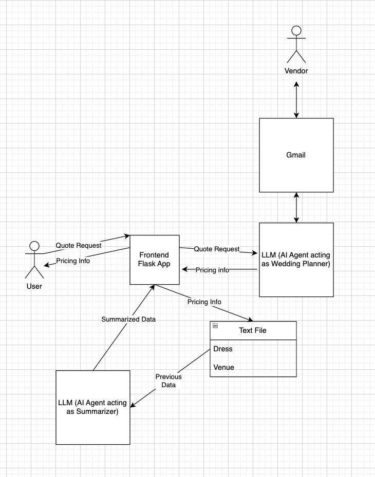
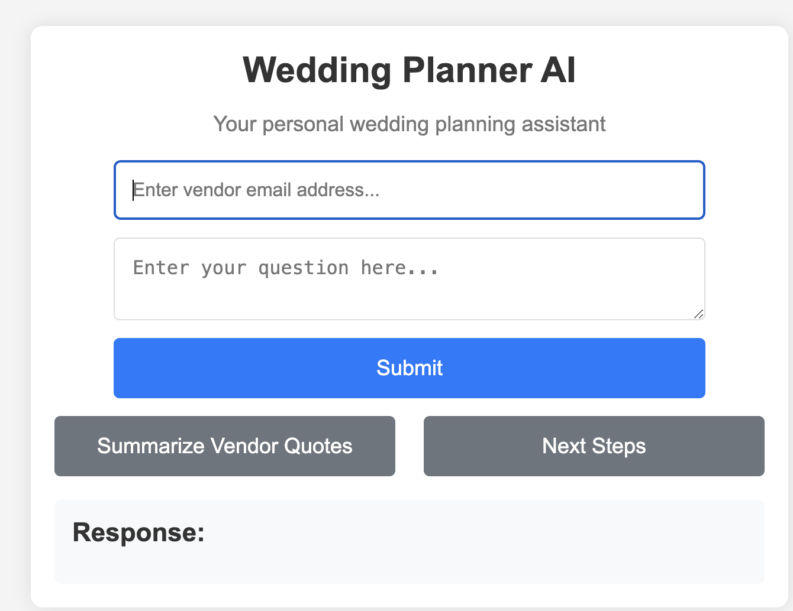
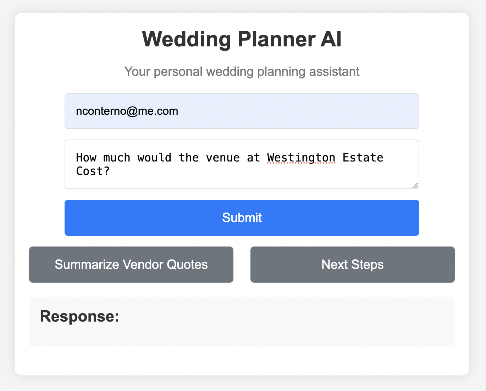
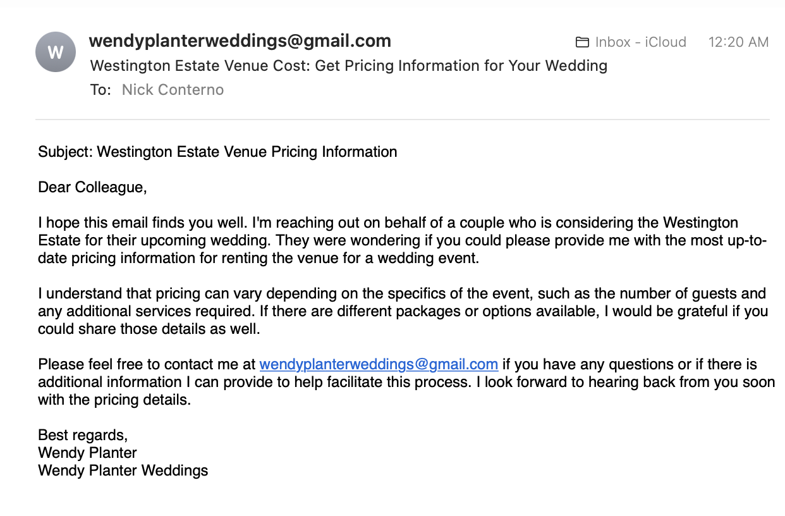
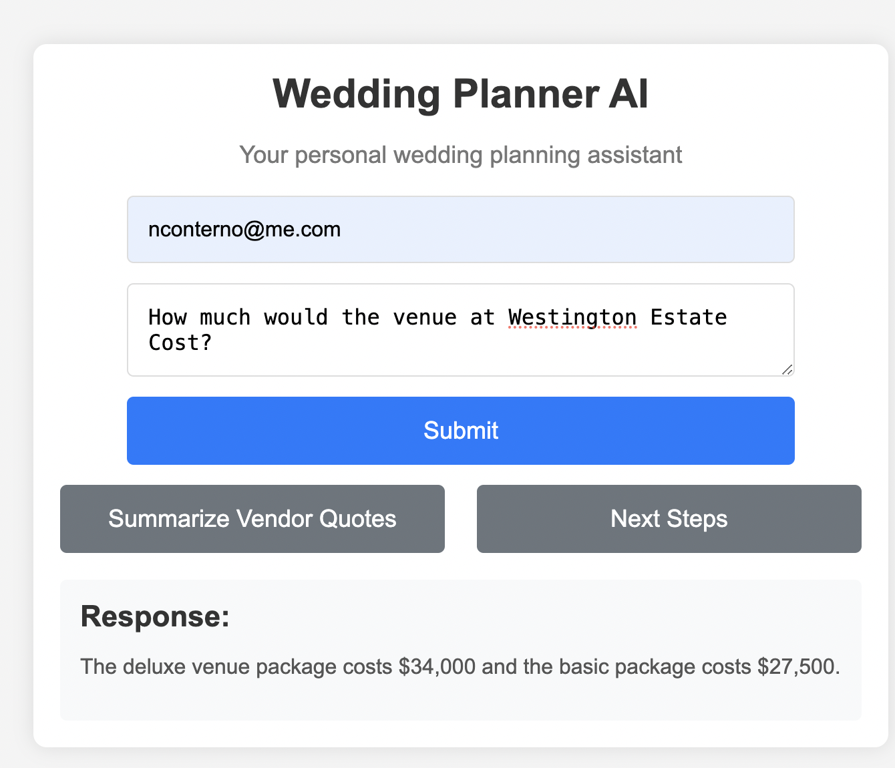
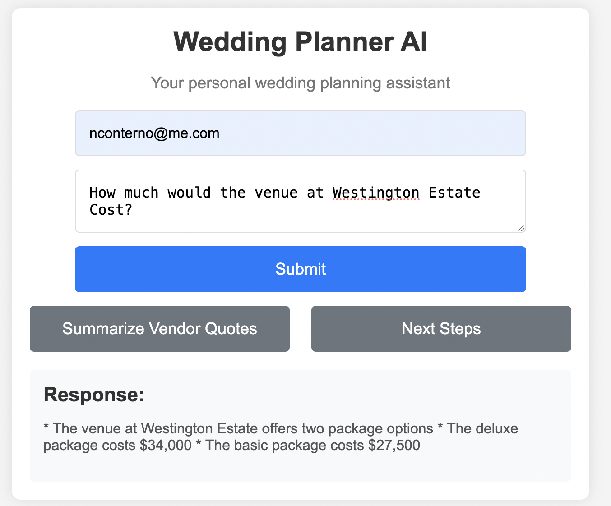
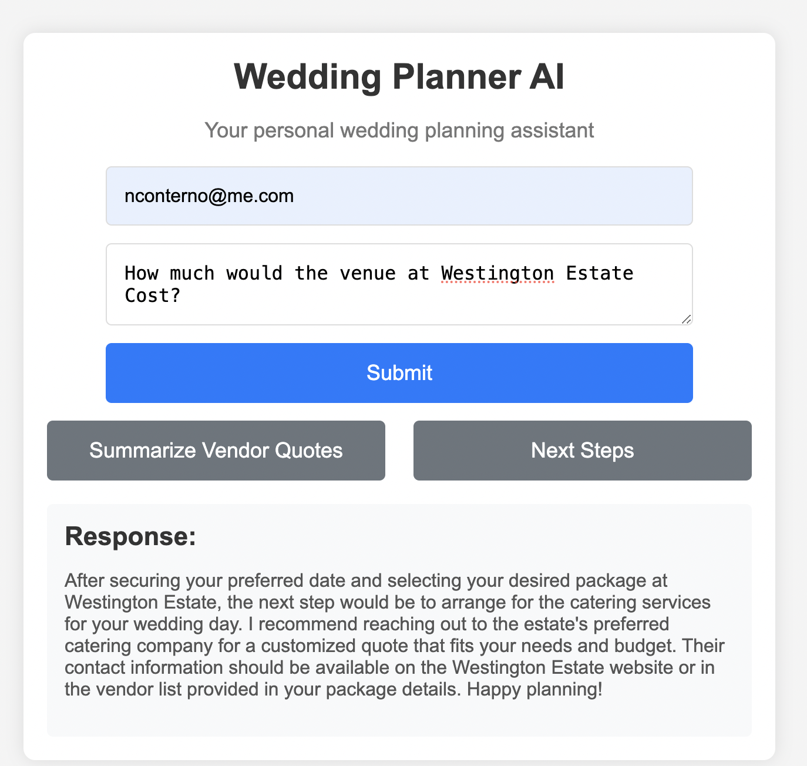

# WeddingPlannerAI

[](https://github.com/nicholasconterno/WeddingPlannerAI/actions/workflows/cicd.yml)

## Video Demo

https://www.youtube.com/watch?v=-ELPbO9MfS0


## Project Purpose

My sister is getting married in the next summer, and has been having to be put through all of the stresses of planning her wedding. A lot of what a wedding planner does is deal with the brides requests, deal with vendors, and have information from the past from her other planned events. 

I thought this might be able to be achieved with an AI agent. 

In theory, an AI agent could deal with a lot of these tasks, but for this project I am attempting just a small part as a sort of proof of concept for the idea as a whole. In a sense it as an excuse to use SLMs as well, but the project as a business, would likely use something more SOTA. 

In this project, we simply have an AI agent which is attempting to acquire information from a vendor through constant communication. Then relaying that information back to the user, who also privded the initial prompt. 

Then the AI agent can also provide possible next steps or a summary of the quotes found to a certain stage. 


## Architecture Diagram


Just to explain this in words.

The user will make a request to the AI to obtain some piece of information from some vendor. The LLM will generate an email to send after receiving the request from the flask frontend. Then this generated email will be sent to the vendor via a gmail account that is setup for the LLM. Then the vendor and the LLM will continue to converse for up to 3 emails. If the information requested still has not been obtained, the LLM will tell the user they could not obtain the information. Otherwise, it summarizes the requested information and displays it via the flask frontend. 

There are also the cases where the user wants a summary of past interactions and/or next steps to accomplish. In this case, they click the proper button on the frontend, the LLM then takes the data which has been stored in a text file. This essentially is a text file which stores all of the email information (after summarization). Then the LLM summarizes these data for the user, or provides next steps based on the quotes already obtained. 


## Setup

First clone the repository
```bash
git clone https://github.com/nicholasconterno/WeddingPlannerAI
cd WeddingPlannerAI
```

Second Create a virtual environment (instructions for MacOS)

```bash
python -m venv venv
source venv/bin/activate
```

Install dependencies
```bash
pip install -r requirements.txt
```


Given that this is designed to use your own SLM and run locally, you may have to make sure they are connected properly.

As of now the following is where we are listening for the SLM (your llamafile)

```
http://host.docker.internal:8080/v1
```

In this case port 8080. If you want to hve your SLM work with this port, it should work properly. If you have an SLM on a different port, you should change all links to your preferred port number. These links can be found in 
```
utils/ai_utils.py
```
There are 3 port numbers needed to be changed in that file.

Make sure your SLM is running locally before attempting to run this application. 

(I will note that to bypass annoying email configuration for the user, I have included the authentication for this AIs personal email address, but please avoid abusing this as it is connected to a real gmail)

Note that the development of this application was done with mistral-7b-instruct as a llamafile which can be downloaded here:
https://github.com/Mozilla-Ocho/llamafile?tab=readme-ov-file


Because this is setup with docker, that will be the easiest way for you to run this application. 

Make sure you have a recent release downloaded on your local and then pull the most recent version of this application

```bash
docker pull nconterno1/weddingplannerai
```

then run 

```bash
docker run -p 80:80 yourusername/weddingplannerai
```

Now the application should be up and running if you go to your localhost at the proper port

For example:

http://127.0.0.1:80


## Example

Then you should see the frontend of the application.



Given the nature of this program to play around with it or test it, you actually will need to act as the vendor and the user, but you can see how the AI Agent will work.

Here is an example of a possible runthrough.



In this case I use my personal email as the 'vendor.' If used in a real world scenario this email would be the actual vendor's email, but response times for that will be much longer (as long as the vendor takes) so I don't recommend it for testing.

Click Submit. 



Then you should see an emailfrom the AI Agent in your (vendor) inbox. You can then respons as a vendor might.
In this example, I am succinct and simply say
'Hello! our prices are 34000 dollars for our deluxe venue package, and 27500 dollars for the basic package.'

Then the Ai Agent ingests the information from the email and gives it to the user.



You can then also click on summary (in this case there isnt much to summarize, but it helps when the LLM has stored a few quotes) 


*note this memory may not persist accross multiple sessions*

You can also then ask the LLM for next steps.



This explains the basic functionality of the application. Feel free to play around with it if you like. 


## Performance/Evaluation

For evaluation, I have human-evaluated the many stages of my LLM calls on certain criteria. I haven't listed the exact prompts here, but they are similar to the example shown above. I will go through the results from that example in my ratings and then I will show the overall results and discuss some of my findings more generally.

So for the first email there are two evaluations, evaluation of the subject line (which the LLM generates) and of the email generated. 

Let's evaluate the first generated email first, based upon three criterion.

Relevance: 10/10  
In this case the LLM pretty much performs exactly how I would hope it would, asking for the requested information.

Clarity: 8/10  
I do think that the information is generally clear, however the email is not super succinct, and they also ask for a variety of different outcomes. Likely this is ok, but I think something more succinct would be better.

Hallucination: 10/10  
In this case no hallucinations occur, typically in my experience this happens when the model just makes something up. As you will see in the scores the model does not always perform to this standard.

Humanness: 9/10  
I am rating this on how well the model's email sounds like an email an actual human wedding planner would write. It does sound a little bit overprofessional to me, but in general it is quite good.

Overall Score: 37/40  

Now let's rate the subject line. I will be using a simple 'clarity' demarcation here simply because it is the essence of a good subject line. I also will use a hallucination

Clarity: 7/10  
Clarity is good although the model chooses to say 'your' wedding which doesn't make sense here.

Hallucination: 5/10  
This is not terrible, but again the use of the word 'your' is obectively not correct.

Overall Score: 12/20  

We also can rate the use of our AI Agent's decision that the information is present. This is a binary system as it is either correct or incorrect. 

Overall Score: 1/1

Now let's rate the response to the user summarizing the information from the vendor's email

Concision: 9/10  
A listed format would be perfect here in this case but all the information is here.

Hallucination: 10/10  
No incorrect information was stated.

Clarity: 10/10
Ths information is stated very simply and correctly.

Overall Score: 29/30

We can also test the summarization feature in this case, on the same criteria.

Concision: 9/10  
There is not a ton of information, I do think it could be presented slightly better though.

Hallucination: 9/10
The asterisks are a bit odd, no incorrect information but I do think something strange is going on.

Clarity: 10/10

all the information is stated quite clearly here.

Overall Score: 28/30

We then, finally, have the next steps stage of the pipeline. Again rated on the same 3 criteria.

Concision: 10/10
I think this response is quite clear and concice

Hallucination: 4/10
It states information about a website and a package that it has no knowledge of, this is a clear hallucination

Clarity; 10/10
Very clear response in my opinion

Overall Score: 24/30


I went through 10 examples for all of these and tallied up the final scores for all of them. 

#### Subject Line Evaluation  
Clarity: 8.7/10  
Hallucination: 7.4/10  
#### First Email Evaluation  
Relevance: 9.4/10  
Clarity: 8.3/10  
Hallucination: 8.5/10  
Humanness: 9.0/10  

#### Second Email Evaluation
(note this was added as I noticed emails became worse as more and more context was added)
Relevance: 6.4/10  
Clarity: 8.5/10  
Hallucination: 6.0/10  
Humanness: 9.1/10  


#### Information Presence Detection  (20 samples)
Correctness: 0.85/1

#### User Summary Response
Concision: 8.5/10  
Hallucination: 7.9/10  
Clarity: 9.4/10
#### Summary Feature
Concision: 8.5/10  
Hallucination: 8.5/10  
Clarity: 9.4/10
#### Next Steps Feature
Concision: 9.4/10  
Hallucination: 6.7/10  
Clarity: 9.4/10

As you can see the model performs pretty well, but it certainly depends on the circumstance. Although I did not explicitly evluate this, I notice that every stage of the pipeline performs worse if inputs are longer, especially those being the vendor email responses. It seems to struggle to actually understand a very large amount of context, especially if the answer is in one small part of them. A SOTA model likely would allow this model to function much better, and most importantly, hallucinate less.
 

As for performance, running on my Mac M1 the time from the submission of a user request to an email being sent off is around 22.4 seconds. All other calls take less time than this. I think for an SLM this is pretty reasonable performance especially when considering the real life use case where most of the waiting time would be waiting on a human vendor to actually respond to an email. The model does take longer for longer inputs and/or long outputs as is expected. 


## Unit Tests

You can run all of the unit tests by running 

```bash
python -m unittest discover -s tests
```

Note that these tests do not really cover the intricacies of the application as it is a local AI Agent based application. We are testing for simple things such as string manipulation, doing some mocking of AI output etc. but we cannot systematically test our actual AI pipelines. For that reason it is best to refer back to the performance and evaluation section to understand a more nuanced discussion on the models performance.

If interested, all tests are in the tests folder but again they are testing basic functionality.


## Github Actions for CI/CD

Installs dependencies for project and for CICD using pip
Checks code formatting with Black
Checks code linting with flake8
Runs unittests
Uses Hadolint to lint the dockerfile
Builds the docker image and pushes the container to dockerhub. 


## Model Selection 

There are a few reasons I chose Mistral-7b-instruct over other SLMs for this project. One large one was simply hardware limitations. Any models of a reasonably larger size (with greater performance potential) would take enormous lengths of time to run or not fit on my computer. Due to speed considerations I needed to go with relatively small models that still had high performance. Compared to a model like Llama-3 it saves a lot of space and adds performance in terms of speed of response. 

This also is a more equitable setup, as it allows more people access to the machine who don't have access to GPUs or perhaps education to access cloud compute. If it was not a local setup, likely a larger model could have been more performant. 

Mistral is instruction finetuned which is very good for my task as I need to have it respond in very specific ways for my AI Agent to work properly. I did experiment with Phi-mini and TinyLlama but they performed much worse with my AI agent setup throughout development, and eventually I chose to optimize for the one performing the best (Mistral-7B-Instruct)

It is certainly not the model that would have the highest evaluation metrics, but it did give the combination of size, speed, context length, and accuracy that I felt made the most sense for this particular local AI Agent use case.

## AI Agent Discussion

As this was my first attempt at creating an AI Agent I think the potential is pretty great, and it also shows the importance of effective evaluation (normal tests may be different and require some threshold similar to latency testing). In my case, I think it is clear that AI Agents are pretty feasible but a lot of times they require pretty complex trees of thought where lots of different scenarios need to be considered. When using the AI to make a decision, the AI really needs to be able to perform adequately, so I think using a SOTA model is always best in that case. I am still glad I spent time understanding a bit how an LLM might control code on its own through some prompt engineering. Likely using the summary embeddings you could also make some kind of classification using an LLM that may be more effective (especially if you trained it for that task). I think my method through prompt engineering can be effective, but for it to be put into production it would need cloud capabilities, better performance, and especially a better context window ( i know the window is claimed to be large but its performance on large windows is different)


